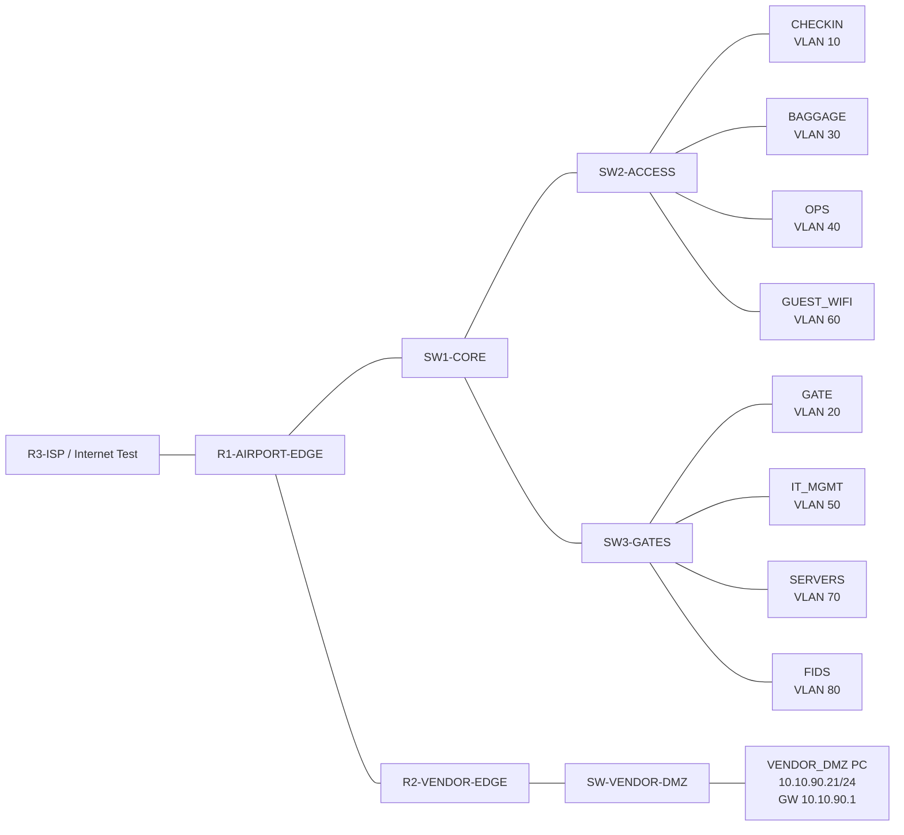

# Airport NOC Network Support Project

## 1. Project Overview

This project documents a realistic **Airport NOC / Aviation IT network support lab** built for portfolio and interview preparation. The lab simulates a small airline or airport station network with segmented networks for check-in, baggage, operations, guest Wi-Fi, gates, IT management, servers, flight information display systems, and a controlled vendor DMZ.

The project is designed for roles such as:

- NOC Analyst
- IT Field Technician
- Junior Network Administrator
- Network Support Technician
- Airport IT Support Technician
- Network Security Analyst trainee
- Cloud/Network Support roles

> This is a training and portfolio simulation inspired by airport IT operations. It does not represent any real airline or airport internal network.

---

## 2. Business Scenario

An airline station at an airport needs reliable network connectivity for operational systems. The Airport NOC team must support multiple business areas while keeping traffic separated and secure:

- Check-in counters and bag-tag printers
- Baggage scanners and baggage application access
- Gate and boarding devices
- Flight information display screens
- IT/admin management systems
- Passenger guest Wi-Fi
- Server/application services
- Third-party vendor support through a controlled DMZ

The goal is to make sure each area has the correct IP address, gateway, VLAN, routing path, and security policy.

---

## 3. High-Level Topology



### Device Roles

| Device | Role |
|---|---|
| R1-AIRPORT-EDGE | Main airport router, inter-VLAN routing, DHCP, ACLs, NAT/WAN path |
| SW1-CORE | Core Layer 2 switch carrying trunks to access switches |
| SW2-ACCESS | Access switch for check-in, baggage, operations, and guest Wi-Fi |
| SW3-GATES | Access switch for gates, IT management, servers, and FIDS |
| R2-VENDOR-EDGE | Controlled vendor edge router and VENDOR_DMZ gateway |
| SW-VENDOR-DMZ | Layer 2 switch for vendor DMZ endpoint |
| R3-ISP | Simulated ISP/internet test router |

---

## 4. VLAN and IP Addressing Plan

| VLAN | Name | Subnet | Gateway | Purpose |
|---:|---|---|---|---|
| 10 | CHECKIN | 10.10.10.0/24 | 10.10.10.1 | Check-in counters and bag-tag printers |
| 20 | GATE | 10.10.20.0/24 | 10.10.20.1 | Gate and boarding devices |
| 30 | BAGGAGE | 10.10.30.0/24 | 10.10.30.1 | Baggage scanners and printers |
| 40 | OPS | 10.10.40.0/24 | 10.10.40.1 | Station operations users |
| 50 | IT_MGMT | 10.10.50.0/24 | 10.10.50.1 | SSH/admin management |
| 60 | GUEST_WIFI | 10.10.60.0/24 | 10.10.60.1 | Passenger Wi-Fi simulation |
| 70 | SERVERS | 10.10.70.0/24 | 10.10.70.1 | DNS, syslog, baggage app, FIDS app |
| 80 | FIDS | 10.10.80.0/24 | 10.10.80.1 | Flight information displays |
| 90 | VENDOR_DMZ | 10.10.90.0/24 | 10.10.90.1 | Controlled vendor access |
| 999 | UNUSED | No client subnet | N/A | Parking VLAN for unused ports |

---

## 5. Core Networking Concepts Demonstrated

### VLAN Segmentation

Each airport business function is separated into its own VLAN. This prevents devices such as guest Wi-Fi clients from being on the same broadcast domain as baggage scanners, IT admin devices, or server systems.

### 802.1Q Trunking

Trunk links carry multiple VLANs between switches and the router. This allows a single physical link to transport traffic for VLAN 10, 20, 30, 40, 50, 60, 70, 80, and other required VLANs.

### Router-on-a-Stick

R1 uses subinterfaces, such as `G0/0.10`, `G0/0.30`, and `G0/0.70`, to route between VLANs. Each subinterface is mapped to a VLAN using `encapsulation dot1Q <VLAN-ID>` and has the default gateway IP for that VLAN.

### DHCP Services

DHCP pools provide automatic IP addressing to endpoint VLANs. Gateway addresses and infrastructure IPs are excluded so they are not accidentally assigned to clients.

### ACL-Based Security

Access control lists limit what each network can reach. For example:

- Guest Wi-Fi is blocked from internal private networks.
- Baggage devices can reach the approved baggage application.
- FIDS devices can reach the FIDS application.
- Vendor DMZ access is restricted to approved internal services only.

### Vendor DMZ Control

The vendor network is separated behind R2. This is important because third-party vendors should not have full internal access. They should only reach approved systems, such as a baggage application server.

---

## 6. R2 Vendor DMZ Configuration Focus

### Intended Vendor DMZ Design

The VENDOR_DMZ endpoint uses:

| Item | Value |
|---|---|
| Vendor endpoint subnet | 10.10.90.0/24 |
| Vendor endpoint example IP | 10.10.90.21 |
| Default gateway | 10.10.90.1 |
| Gateway device | R2-VENDOR-EDGE |
| R2 vendor-facing interface | GigabitEthernet0/1 |
| Approved internal app | 10.10.70.30 |

### R2 Vendor-Facing Interface

```cisco
interface GigabitEthernet0/1
 description VENDOR_DMZ_GATEWAY_TO_SW-VENDOR-DMZ
 ip address 10.10.90.1 255.255.255.0
 ip access-group VENDOR-DMZ-IN in
 no shutdown
```

#### Why this configuration is used

- `ip address 10.10.90.1 255.255.255.0` makes R2 the default gateway for the VENDOR_DMZ subnet.
- `ip access-group VENDOR-DMZ-IN in` applies the vendor security policy as traffic enters R2 from the vendor network.
- `no shutdown` makes sure the interface is administratively enabled.

---

## 7. Vendor DMZ ACL — Corrected Version

During troubleshooting, the VENDOR_DMZ PC could not ping its default gateway `10.10.90.1`. The router log showed that ACL `VENDOR-DMZ-IN` denied ICMP from `10.10.90.21` to `10.10.90.1`.

### Root Cause

The ACL denied traffic from `10.10.90.0/24` to `10.10.0.0/16` before allowing ICMP to the gateway. Since `10.10.90.1` is part of `10.10.0.0/16`, the gateway ping was blocked by the internal-network deny rule.

### Corrected ACL

```cisco
ip access-list extended VENDOR-DMZ-IN
 permit udp any eq 68 any eq 67
 permit icmp 10.10.90.0 0.0.0.255 host 10.10.90.1
 permit tcp 10.10.90.0 0.0.0.255 host 10.10.70.30 eq 443
 permit icmp 10.10.90.0 0.0.0.255 host 10.10.70.30
 deny ip 10.10.90.0 0.0.0.255 10.10.0.0 0.0.255.255 log
 permit ip 10.10.90.0 0.0.0.255 any
```

### Why each ACL line is used

| ACL Line | Purpose |
|---|---|
| `permit udp any eq 68 any eq 67` | Allows DHCP Discover/Request traffic so vendor clients can receive an IP address. |
| `permit icmp 10.10.90.0 0.0.0.255 host 10.10.90.1` | Allows vendor clients to ping their own default gateway for basic troubleshooting. |
| `permit tcp 10.10.90.0 0.0.0.255 host 10.10.70.30 eq 443` | Allows vendor HTTPS access only to the approved baggage application server. |
| `permit icmp 10.10.90.0 0.0.0.255 host 10.10.70.30` | Allows limited ping testing to the approved application server. |
| `deny ip 10.10.90.0 0.0.0.255 10.10.0.0 0.0.255.255 log` | Blocks the vendor DMZ from accessing the wider internal airport network. |
| `permit ip 10.10.90.0 0.0.0.255 any` | Allows other non-internal destinations, such as internet/WAN test traffic, if routing/NAT permits. |

### Important ACL Lesson

Cisco ACLs are processed **top to bottom**. The first matching rule wins. More specific permit rules must be placed above broader deny rules.

---

## 8. Troubleshooting Case Study: VENDOR_DMZ Cannot Ping Gateway

### Problem

The VENDOR_DMZ PC could not ping:

```text
10.10.90.1
```

### Observed Router Log

```text
%SEC-6-IPACCESSLOGDP: list VENDOR-DMZ-IN denied icmp 10.10.90.21 -> 10.10.90.1
```

### Meaning of the Log

The packet reached R2, but R2 denied it using the `VENDOR-DMZ-IN` ACL. This proves the issue was not primarily the cable, switch, or endpoint IP configuration. The issue was ACL logic/order.

### Fix Applied

Add the gateway ICMP permit before the internal-network deny rule:

```cisco
ip access-list extended VENDOR-DMZ-IN
 permit icmp 10.10.90.0 0.0.0.255 host 10.10.90.1
```

If ACL sequence editing is limited in Packet Tracer, rebuild the ACL in the corrected order.

### Verification Commands

```cisco
show access-lists VENDOR-DMZ-IN
show running-config interface GigabitEthernet0/1
show ip interface brief
show ip route
```

### Expected Results

| Test | Expected Result |
|---|---|
| VENDOR_DMZ PC -> 10.10.90.1 | Success |
| VENDOR_DMZ PC -> 10.10.70.30 | Success if server is reachable and ACL permits it |
| VENDOR_DMZ PC -> other 10.10.x.x internal networks | Blocked by ACL |
| ACL hit counters | Increase on the correct permit/deny lines |

---

## 9. Build Steps

1. Create the routers and switches in Packet Tracer or EVE-NG.
2. Cable R1 to SW1, R1 to R2, R1 to R3, R2 to SW-VENDOR-DMZ, and SW1 to SW2/SW3.
3. Create VLANs on the required switches.
4. Configure trunk links between R1/SW1 and SW1/SW2/SW3.
5. Configure endpoint access ports in the correct VLANs.
6. Configure router-on-a-stick subinterfaces on R1.
7. Configure R2 as the VENDOR_DMZ gateway.
8. Configure DHCP pools and excluded addresses.
9. Apply ACLs inbound on the correct router interfaces.
10. Run verification commands and document successful/blocked traffic tests.

---

## 10. Verification Checklist

### Switching Verification

```cisco
show vlan brief
show interfaces trunk
show spanning-tree vlan 70
```

### Routing Verification

```cisco
show ip interface brief
show ip route
show running-config interface GigabitEthernet0/0.70
show running-config interface GigabitEthernet0/1
```

### DHCP Verification

```cisco
show ip dhcp binding
show ip dhcp pool
show running-config | section dhcp
```

### ACL Verification

```cisco
show access-lists
show access-lists VENDOR-DMZ-IN
show running-config | section ip access-list
```

### Endpoint Tests

```text
CHECKIN -> ping 10.10.10.1
BAGGAGE -> ping 10.10.30.1
GUEST_WIFI -> ping 10.10.60.1
SERVERS -> ping 10.10.70.1
FIDS -> ping 10.10.80.1
VENDOR_DMZ -> ping 10.10.90.1
VENDOR_DMZ -> ping 10.10.70.30
VENDOR_DMZ -> test blocked access to other internal 10.10.x.x networks
```

---

## 11. Common Mistakes and Fixes

| Mistake | Symptom | Fix |
|---|---|---|
| VLAN missing from trunk | Devices cannot reach gateway or servers | Check `show interfaces trunk` and allowed VLAN list |
| Access port in wrong VLAN | Client gets wrong IP or cannot communicate | Check `show vlan brief` |
| Router subinterface missing `encapsulation dot1Q` | VLAN cannot route | Add correct `encapsulation dot1Q <VLAN-ID>` |
| ACL applied in wrong direction | Policy does not work as expected | Check interface and `in`/`out` direction |
| Broad deny rule placed before specific permit | Valid traffic is blocked | Reorder ACL with specific permits first |
| DHCP blocked by ACL | Client receives no IP address | Permit DHCP before deny rules |
| Interface shutdown | Link remains down | Use `no shutdown` |
| Switch has no default gateway | SSH management from other subnets fails | Configure `ip default-gateway` on Layer 2 switches |

---

## 12. Interview Explanation

In this project, I built and documented an airport-inspired network support lab with VLAN segmentation for check-in, baggage, operations, guest Wi-Fi, gate systems, IT management, servers, FIDS, and a vendor DMZ. I used 802.1Q trunking, router-on-a-stick inter-VLAN routing, DHCP scopes, and ACL-based segmentation to model a realistic NOC environment. I also troubleshot a vendor DMZ issue where the endpoint could not ping its default gateway because the ACL denied ICMP to `10.10.90.1`. I corrected the ACL order by allowing gateway ICMP before the broader internal deny rule. This demonstrates practical troubleshooting, security segmentation, and Cisco verification skills.

---

## 13. Skills Demonstrated

- Cisco VLAN design
- 802.1Q trunking
- Router-on-a-stick routing
- DHCP configuration and troubleshooting
- ACL design and ACL order troubleshooting
- Vendor DMZ segmentation
- WAN/vendor routing simulation
- NOC-style incident analysis
- Packet Tracer/EVE-NG lab documentation
- GitHub portfolio documentation

---

## 14. Resume Bullet

Built and documented an airport-inspired NOC network support lab using Cisco VLANs, 802.1Q trunks, router-on-a-stick inter-VLAN routing, DHCP, ACL-based guest/vendor isolation, vendor DMZ controls, WAN simulation, and troubleshooting workflows for airport IT support and network operations roles.

---

## 15. Evidence to Add Later

Recommended screenshots for future portfolio improvement:

- Full lab topology screenshot
- `show vlan brief`
- `show interfaces trunk`
- `show ip interface brief`
- `show access-lists VENDOR-DMZ-IN`
- Successful VENDOR_DMZ ping to `10.10.90.1`
- Blocked vendor access to unauthorized internal networks
- Successful approved access to `10.10.70.30`

---

## 16. Key Learning Outcome

The most important lesson from this lab is that security policies must be tested in the same way real users and devices generate traffic. In this case, the network path was working, but ACL order blocked the VENDOR_DMZ PC from pinging its own default gateway. Reading the ACL log and understanding top-down ACL processing led directly to the fix.
