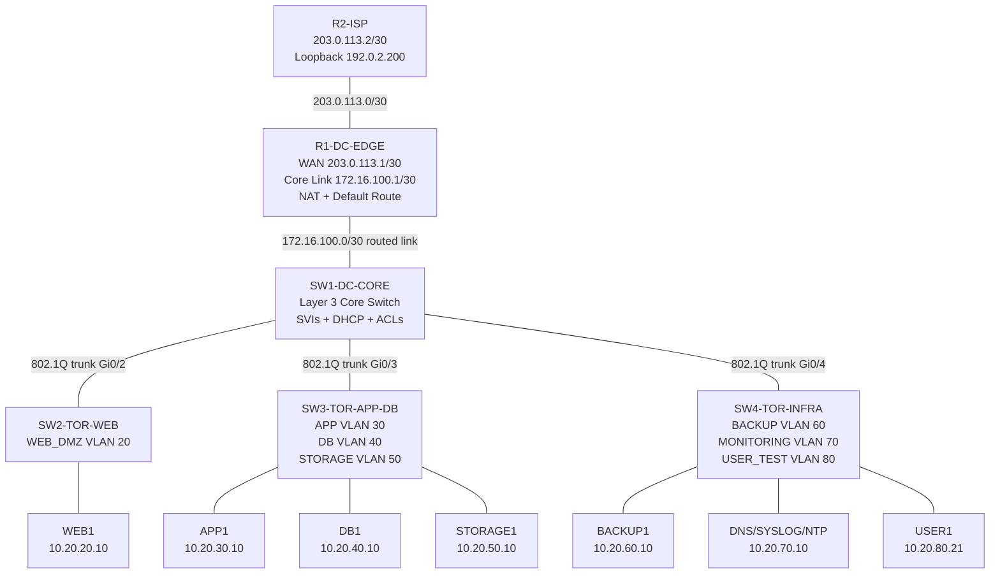

# Data Center Network Support Project

> **Portfolio project for Network Support, NOC Analyst, Junior Network Administrator, Cloud/Network Support, and Data Center Technician roles.**

This project documents a small enterprise data center network lab using Cisco-style switching, routing, VLAN segmentation, ACL security policy, NAT internet simulation, and NOC-style troubleshooting workflows.

The lab is designed to show employers that I can understand, build, document, verify, and troubleshoot a realistic data center network environment.

---

## 1. Project Objective

Build a structured data center network support lab that demonstrates:

- Layer 3 core switching with SVIs
- VLAN segmentation for server tiers
- 802.1Q trunking to top-of-rack switches
- Data center edge routing and NAT
- DHCP scopes for lab clients
- ACL-based traffic control between zones
- Monitoring, storage, backup, and management VLAN design
- NOC-style verification and troubleshooting
- Recruiter-friendly GitHub documentation

---

## 2. Business Scenario

A medium-sized company hosts business applications in a small data center. The network team must keep services available while separating traffic for security, troubleshooting, and performance.

The company needs separate network zones for:

- Management and SSH administration
- Web/DMZ servers
- Application servers
- Database servers
- Storage systems
- Backup systems
- Monitoring and syslog/SNMP/NTP tools
- User test clients
- Internet/WAN simulation

This is similar to environments supported by NOC teams, managed service providers, banks, cloud support teams, enterprise IT teams, and data center technicians.

---

## 3. High-Level Topology



---

## 4. Device Roles

| Device | Role |
|---|---|
| `R1-DC-EDGE` | Data center edge router, NAT, default route to ISP, internal route back to SW1 core |
| `R2-ISP` | Simulated ISP/internet router with loopback test destination |
| `SW1-DC-CORE` | Layer 3 core switch with SVIs, DHCP, inter-VLAN routing, and ACLs |
| `SW2-TOR-WEB` | Top-of-rack switch for web/DMZ servers |
| `SW3-TOR-APP-DB` | Top-of-rack switch for app, database, and storage servers |
| `SW4-TOR-INFRA` | Top-of-rack switch for monitoring, backup, test users, and admin access |

---

## 5. VLAN and IP Addressing Plan

| VLAN | Name | Subnet | Gateway | Purpose |
|---:|---|---|---|---|
| 10 | MGMT | `10.20.10.0/24` | `10.20.10.1` | Network management, SSH, switch SVIs |
| 20 | WEB_DMZ | `10.20.20.0/24` | `10.20.20.1` | Web/DMZ servers |
| 30 | APP | `10.20.30.0/24` | `10.20.30.1` | Application servers |
| 40 | DB | `10.20.40.0/24` | `10.20.40.1` | Database servers |
| 50 | STORAGE | `10.20.50.0/24` | `10.20.50.1` | Storage/NAS/iSCSI simulation |
| 60 | BACKUP | `10.20.60.0/24` | `10.20.60.1` | Backup systems |
| 70 | MONITORING | `10.20.70.0/24` | `10.20.70.1` | DNS, syslog, SNMP, NTP, monitoring tools |
| 80 | USER_TEST | `10.20.80.0/24` | `10.20.80.1` | Test user/client VLAN |
| 99 | NATIVE_BLACKHOLE | No client subnet | N/A | Non-user native VLAN for trunks |
| 999 | UNUSED | No client subnet | N/A | Shutdown parking VLAN for unused switch ports |

---

## 6. Routed Links

| Link | Local Side | Remote Side | Purpose |
|---|---|---|---|
| R1 to R2 ISP | R1 Gi0/1 = `203.0.113.1/30` | R2 Gi0/0 = `203.0.113.2/30` | Simulated internet/WAN link |
| R1 to SW1 Core | R1 Gi0/0 = `172.16.100.1/30` | SW1 Gi0/1 = `172.16.100.2/30` | Routed link between edge and Layer 3 core |
| R2 loopback | `192.0.2.200/32` | N/A | Internet ping test destination |

---

## 7. Security Policy

| Source Zone | Allowed Access | Blocked Access |
|---|---|---|
| MGMT | SSH/SNMP/ICMP to infrastructure and servers | Restricted to admin devices in production |
| USER_TEST | HTTP/HTTPS to WEB_DMZ, DNS to monitoring/DNS | Direct APP, DB, STORAGE, BACKUP, and MGMT access |
| WEB_DMZ | DNS and approved API/HTTPS traffic to APP | Direct DB, STORAGE, BACKUP, and MGMT access |
| APP | DB access, storage access, DNS/NTP | Direct MGMT access |
| DB | DNS/NTP and replies to approved app traffic | User and web direct access |
| STORAGE | Access from app/backup/admin systems only | User and web direct access |
| BACKUP | Backup/restore access to protected server VLANs | User direct access |
| MONITORING | Syslog/SNMP/NTP/ICMP monitoring | General user services |

---

## 8. Key Design Decisions

### Layer 3 Core Switch

`SW1-DC-CORE` performs internal routing using SVIs. This is common in enterprise and data center designs because server-to-server traffic can stay inside the switching fabric instead of hairpinning through a router-on-a-stick link.

### Top-of-Rack Switching

Each server group connects to a top-of-rack switch. This keeps cabling clean and lets each rack carry only the VLANs it needs:

- `SW2-TOR-WEB`: WEB_DMZ and management
- `SW3-TOR-APP-DB`: APP, DB, STORAGE, and management
- `SW4-TOR-INFRA`: BACKUP, MONITORING, USER_TEST, and management

### Three-Tier Application Segmentation

The lab uses a simple three-tier model:

1. Users access WEB servers.
2. WEB servers access APP servers on approved ports.
3. APP servers access DB servers on approved database ports.

This prevents users and public-facing web servers from directly reaching protected databases.

### ACL-Based Tier Isolation

Extended ACLs enforce traffic rules between VLANs. For example, USER_TEST clients can access web services but are blocked from directly accessing DB and storage networks.

### Native VLAN and Unused Port Hardening

- VLAN 99 is used as a blackhole native VLAN on trunks.
- VLAN 999 is used for unused switch ports, and unused ports are shut down.

---

## 9. Core Configuration Highlights

### R1-DC-EDGE — NAT and Routing

```cisco
interface GigabitEthernet0/0
 description ROUTED_LINK_TO_SW1_DC_CORE_Gi0/1
 ip address 172.16.100.1 255.255.255.252
 ip nat inside
 no shutdown

interface GigabitEthernet0/1
 description WAN_TO_R2_ISP_Gi0/0
 ip address 203.0.113.1 255.255.255.252
 ip nat outside
 no shutdown

ip route 10.20.0.0 255.255.0.0 172.16.100.2
ip route 0.0.0.0 0.0.0.0 203.0.113.2

ip access-list standard DC-NAT
 permit 10.20.0.0 0.0.255.255

ip nat inside source list DC-NAT interface GigabitEthernet0/1 overload
```

**Why this matters:** R1 provides the edge path to the ISP, translates internal data center traffic with PAT/NAT overload, and knows how to route back to internal `10.20.0.0/16` networks through the core switch.

### SW1-DC-CORE — Layer 3 Routing and VLAN Gateways

```cisco
ip routing

interface Vlan20
 description WEB_DMZ_GATEWAY
 ip address 10.20.20.1 255.255.255.0
 ip access-group WEB-DMZ-IN in
 no shutdown

interface Vlan30
 description APP_GATEWAY
 ip address 10.20.30.1 255.255.255.0
 ip access-group APP-IN in
 no shutdown

interface Vlan40
 description DB_GATEWAY
 ip address 10.20.40.1 255.255.255.0
 ip access-group DB-IN in
 no shutdown

interface Vlan80
 description USER_TEST_GATEWAY
 ip address 10.20.80.1 255.255.255.0
 ip access-group USER-TEST-IN in
 no shutdown

ip route 0.0.0.0 0.0.0.0 172.16.100.1
```

**Why this matters:** The core switch acts as the default gateway for the data center VLANs and applies security policy close to each source VLAN.

### USER_TEST-IN ACL — User Access Control

```cisco
ip access-list extended USER-TEST-IN
 remark Users can reach web services and DNS, but not internal server VLANs directly
 permit udp any eq 68 any eq 67
 permit udp 10.20.80.0 0.0.0.255 host 10.20.70.10 eq 53
 permit tcp 10.20.80.0 0.0.0.255 10.20.20.0 0.0.0.255 eq 80
 permit tcp 10.20.80.0 0.0.0.255 10.20.20.0 0.0.0.255 eq 443
 permit icmp 10.20.80.0 0.0.0.255 10.20.20.0 0.0.0.255
 deny ip 10.20.80.0 0.0.0.255 10.20.0.0 0.0.255.255 log
 permit ip 10.20.80.0 0.0.0.255 any
```

**Why this matters:** Test users can reach web services and DNS, but they cannot directly access internal APP, DB, STORAGE, BACKUP, or MGMT networks.

---

## 10. Build Steps

1. Add devices: `R1-DC-EDGE`, `R2-ISP`, `SW1-DC-CORE`, `SW2-TOR-WEB`, `SW3-TOR-APP-DB`, `SW4-TOR-INFRA`, and endpoint servers.
2. Cable R1 to R2, R1 to SW1, and SW1 to each top-of-rack switch.
3. Create VLANs on SW1/SW2/SW3/SW4.
4. Configure SW1 as a Layer 3 core switch with `ip routing` and SVIs.
5. Configure trunks from SW1 to SW2/SW3/SW4.
6. Configure R1 with NAT, static routes, and ISP connectivity.
7. Configure R2 as the ISP test router with loopback `192.0.2.200`.
8. Configure access ports for WEB, APP, DB, STORAGE, BACKUP, MONITORING, USER_TEST, and MGMT endpoints.
9. Apply ACLs to SVIs on SW1.
10. Run verification tests and document results.

---

## 11. Verification Commands

### R1-DC-EDGE

```cisco
show ip interface brief
show ip route
show ip nat translations
show access-lists DC-NAT
ping 203.0.113.2
ping 192.0.2.200
```

### SW1-DC-CORE

```cisco
show ip interface brief
show ip route
show vlan brief
show interfaces trunk
show ip dhcp binding
show access-lists
```

### SW2/SW3/SW4

```cisco
show vlan brief
show interfaces trunk
show running-config interface vlan 10
show spanning-tree vlan 20
```

---

## 12. Expected Test Results

| Test | Expected Result |
|---|---|
| ADMIN1 -> `10.20.10.1` | Success |
| ADMIN1 -> SSH to switches | Success |
| USER1 -> `10.20.80.1` | Success |
| USER1 -> WEB1 `10.20.20.10` HTTP/HTTPS | Success |
| USER1 -> DB1 `10.20.40.10` | Blocked by `USER-TEST-IN` ACL |
| WEB1 -> APP1 `10.20.30.10` TCP 8443 / ICMP | Permitted by `WEB-DMZ-IN` ACL |
| WEB1 -> DB1 `10.20.40.10` directly | Blocked by `WEB-DMZ-IN` ACL |
| APP1 -> DB1 `10.20.40.10` TCP 3306 | Permitted by `APP-IN` ACL |
| USER1 -> `192.0.2.200` | Success if NAT/routing is working |

---

## 13. Troubleshooting Scenarios

| Problem | Likely Root Cause | Commands to Check |
|---|---|---|
| Client gets no IP address | Wrong access VLAN, DHCP pool missing, SVI down, ACL blocking DHCP | `show vlan brief`, `show ip dhcp binding`, `show access-lists` |
| VLAN cannot reach gateway | SVI down, no active port in VLAN, wrong IP/mask | `show ip interface brief`, `show vlan brief` |
| Trunk not carrying VLAN | VLAN missing from allowed list, native VLAN mismatch, wrong switchport mode | `show interfaces trunk`, `show run interface g0/x` |
| USER_TEST can reach DB directly | ACL missing, ACL applied wrong direction, broad permit above deny | `show access-lists USER-TEST-IN`, `show run interface vlan80` |
| WEB cannot reach APP | Missing APP permit, wrong APP IP, trunk issue | `show access-lists WEB-DMZ-IN`, `ping`, `traceroute` |
| APP cannot reach DB | Missing DB port permit, DB gateway wrong, VLAN 40 missing from trunk | `show access-lists APP-IN`, `show ip route`, `show interfaces trunk` |
| Internet test fails | Default route missing, NAT missing, ISP route missing | `show ip route`, `show ip nat translations`, `show run | include nat` |
| SSH fails | Source not in MGMT VLAN, VTY access-class blocking source, SSH keys missing | `show ip ssh`, `show access-lists SSH-MGMT`, `show run | section line vty` |

---

## 14. NOC Incident Case Study

### Incident

Users report that the company web portal loads, but it cannot retrieve customer records from the database.

### Troubleshooting Workflow

1. Confirm USER1 can reach WEB1.
2. Confirm WEB1 can reach APP1 on the approved application port.
3. Confirm APP1 can reach DB1 on TCP 3306.
4. Check ACL counters on SW1 core.
5. Check trunk allowed VLANs between SW1 and SW3.
6. Verify APP and DB servers have correct default gateways.

### Likely Root Causes

- `APP-IN` ACL missing the DB permit.
- DB server has the wrong default gateway.
- VLAN 40 is missing from SW1-to-SW3 trunk.
- DB server is connected to the wrong access VLAN.

### Example Resolution

```cisco
interface GigabitEthernet0/3
 switchport trunk allowed vlan 10,30,40,50,99,999
```

Verify with:

```cisco
show interfaces trunk
ping 10.20.40.10
show access-lists APP-IN
```

---

## 15. Common Mistakes

1. Forgetting `ip routing` on the multilayer switch.
2. Creating VLANs but forgetting to allow them on trunks.
3. Applying ACLs in the wrong direction.
4. Blocking DHCP with ACLs.
5. Using the wrong wildcard mask in ACLs.
6. Giving servers the wrong default gateway.
7. Forgetting the default route on SW1 core.
8. Forgetting return routes on R1/R2.
9. Leaving access ports in VLAN 1.
10. Not shutting down unused ports.
11. Using the native VLAN for real traffic.
12. Forgetting to save the configuration.

---

## 16. Interview Explanation

In this project, I built a small enterprise data center network with a Layer 3 core switch and multiple top-of-rack switches. I separated services into VLANs for management, web DMZ, application, database, storage, backup, monitoring, and user testing. I configured SVIs on the core switch as default gateways, enabled inter-VLAN routing, used 802.1Q trunks to the top-of-rack switches, and created ACLs to control traffic between tiers. I also configured an edge router with NAT and a simulated ISP router for internet testing. I verified the design using commands such as `show ip interface brief`, `show interfaces trunk`, `show ip route`, `show ip dhcp binding`, and `show access-lists`.

---

## 17. Skills Demonstrated

- Data center VLAN design
- Layer 3 switching and SVIs
- 802.1Q trunking
- Top-of-rack access switching
- DHCP scope design
- ACL-based segmentation
- NAT/PAT internet simulation
- Static routing
- Monitoring and backup network design
- Server-tier troubleshooting
- NOC-style incident workflow
- Technical GitHub documentation

---

## 18. Resume Bullet

Built and documented a data center network support lab using Cisco Layer 3 switching, VLAN segmentation, 802.1Q trunks, SVIs, DHCP scopes, ACL-based tier isolation, NAT internet simulation, top-of-rack switching, monitoring/storage/backup VLANs, and NOC-style verification and troubleshooting workflows.

---

## 19. Evidence to Add Later

Recommended screenshots to add after building the lab in Packet Tracer, EVE-NG, or GNS3:

- Full topology screenshot
- `show interfaces trunk`
- `show ip interface brief`
- `show ip route`
- `show access-lists`
- Successful USER_TEST to WEB_DMZ test
- Blocked USER_TEST to DB test
- APP to DB allowed test
- NAT/internet test to `192.0.2.200`

---

## 20. Project Status

- Documentation: complete
- Config design: complete in source lab guide
- Packet Tracer/EVE-NG build evidence: to be added after simulator build
- Screenshots: to be added after simulator build
